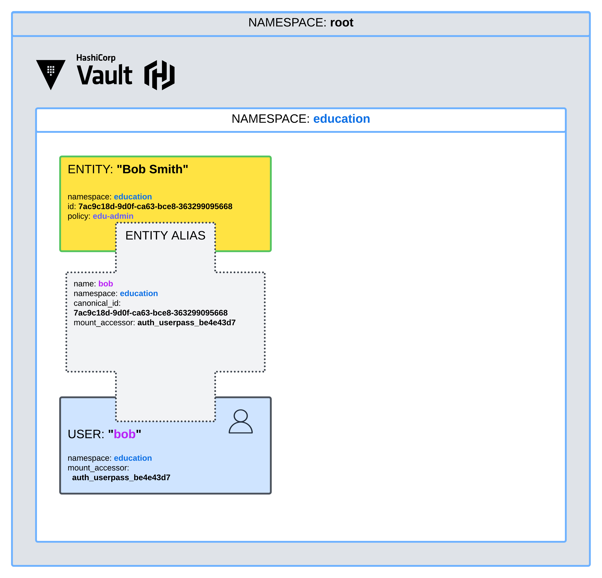
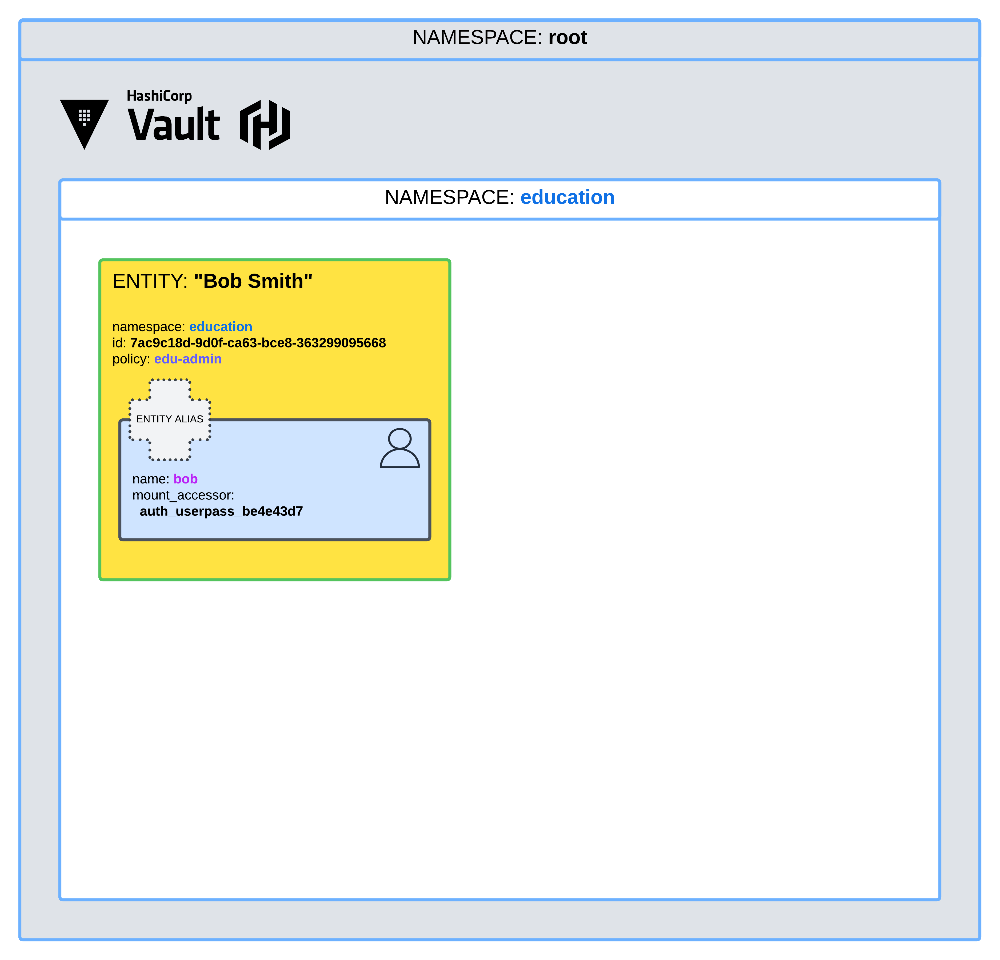
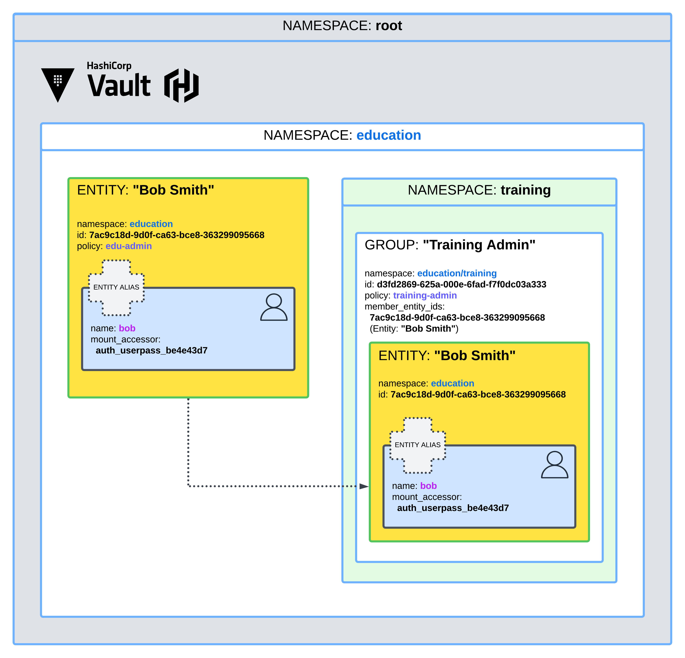

# HCP Vault Patterns: Entities and Clients

## PREREQUISITES

- [Vault Enterprise environment](https://github.com/F0otsh0T/hcp-vault-docker/tree/main/00-vault/terraform/vault-enterprise)
- [Vault CLI](https://developer.hashicorp.com/vault/docs/install)

## MULTI-TENANCY

**[Secure multi-tenancy with namespaces](https://developer.hashicorp.com/vault/tutorials/enterprise/namespaces)**

#### Option 1
Enable the auth method in each namespace with entity alias and internal groups.

- Create Entity and User

- Alias Auth Objects to Entity

- Create Group in target `namespace` with `entity` as member

#### Option 2
When utilizing an auth method such as `ldap` or `okta`, map appropriate policies to those externally defined groups. Enable the auth method in the root namespace and use Identity Groups to pull in external groups and map policies in each namespace.

## REFERENCE
- https://developer.hashicorp.com/vault/docs/concepts/identity#entities-and-aliases
- https://developer.hashicorp.com/vault/tutorials/auth-methods/identity
- https://developer.hashicorp.com/vault/tutorials/enterprise/namespaces#set-up-entities-and-groups
- https://developer.hashicorp.com/vault/tutorials/enterprise/namespaces
- https://developer.hashicorp.com/vault/api-docs/secret/identity/entity-alias