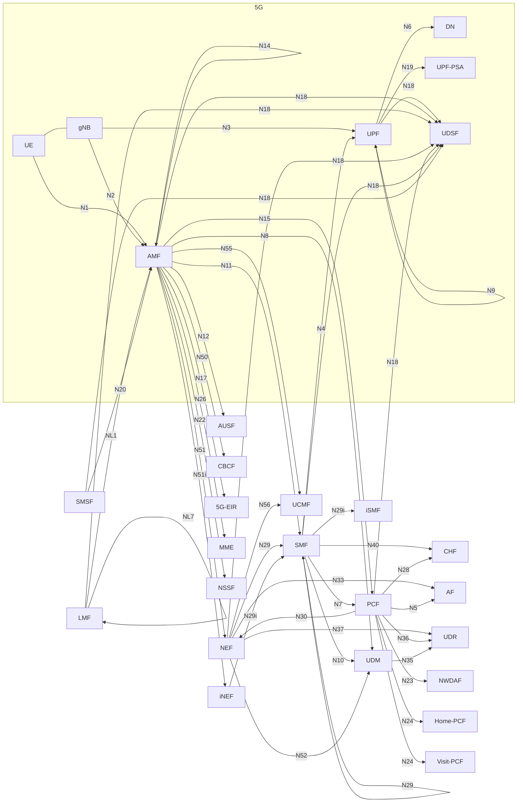

---
tags:
  - docker
  - hashicorp
  - hcp-vault
  - vault
  - hcp-terraform
  - terraform
  - pki
  - mtls
  - tech
alias:
  - HashiCorp Vault: Secrets / PKI / mTLS Cross-Sign
---

---
# HashiCorp Vault: Secrets / PKI / mTLS Cross-Sign

PKI mTLS Cross-Sign Pattern

## Introduction

#### Contents

```shell
.
├── xsign-app-based-roots
│   ├── data
│   │   ├── ..
│   │   └── .
│   ├── workspace
│   │   ├── ..
│   │   └── .
│   ├── Makefile
│   └── README.md
├── xsign-service-based-roots
│   ├── data
│   │   ├── ..
│   │   └── .
│   ├── workspace
│   │   ├── ..
│   │   └── .
│   ├── Makefile
│   └── README.md
├── Makefile
└── README.md
```

#### Cast of Characters

- `PCF` == Bob
- `SMF` == Alice
- `AMF` == Carol
- `NEF` == Charlie

#### Interactions

`NEF` >> **N29** >> `SMF` >> **N7** >> `PCF`

`SMF` << **N11** << `AMF` >> **N15** >> `PCF`

- **N29** / `NEF` >> `SMF`
- **N7**  / `SMF` >> `PCF`
- **N11** / `AMF` >> `SMF`
- **N15** / `AMF` >> `PCF`

#### Service Based Architecture Flows

###### Basic Flow (Alice & Bob):

- **N7**  / `SMF` >> `PCF` SBA Flow
  ```mermaid
  graph LR
    SMF -- N7 --> PCF;
  ```


- **N7**  / `SMF` >> `PCF` PKI Trust Chain:
  ```mermaid
  graph LR 
    SMF-ROOT==N7-CSR==>PCF-ROOT==N7-IMPORT==>SMF-INT-N7


    subgraph SMF
    SMF-ROOT((SMF-ROOT))-->SMF-INT-N7-->SMF-N7-Leaf>SMF-N7-Leaf]
    SMF-ROOT((SMF-ROOT))-->SMF-INT-->SMF-Server-Leaf>SMF-Server-Leaf]
    end

    subgraph PCF
    PCF-ROOT((PCF-ROOT))-->PCF-INT-->PCF-Server-Leaf>PCF-Server-Leaf]
    end

  ```
###### Adding more Characters (Carol, Charlie, Alice, & Bob):


#### PKI Cross-Sign Flows: Application Based Roots

CA Root per Application: Each Application (CNF) in this case will get it's own CA Root but the caveat here is that once a CA Root Cross-Signs, the `TRUSTED` PKI Chain then will be able to access resources Signed by that [*Signing*] Root.

For example, If the `PCF` Cross-Signs the CSR from the `AMF` for the `N15` interaction in the diagram above, the `AMF` will be able to access the `PCF` on both the `N15` ***AND*** `N7` Service APIs Signed by the `PCF`'s CA Root & Intermediate.


#### PKI Cross-Sign Flows: Service Based Roots

CA Root per N-Interface Service: Better Access Controls for each Service


#### 5G Packet Core SBA



## Steps

```shell
~/make -f Makefile all
```

[[]]

## References
- https://www.vaultproject.io/api-docs/secret/pki
- https://public.cyber.mil/pki-pke/interoperability/
- https://playbooks.idmanagement.gov/fpki/
- https://www.ssltrust.com/blog/understanding-certificate-cross-signing
- https://www.ietf.org/id/draft-housley-lamps-3g-nftypes-00.html#section-3
- https://www.etsi.org/deliver/etsi_ts/133300_133399/133310/16.07.00_60/ts_133310v160700p.pdf
- 

## Appendix

- 
